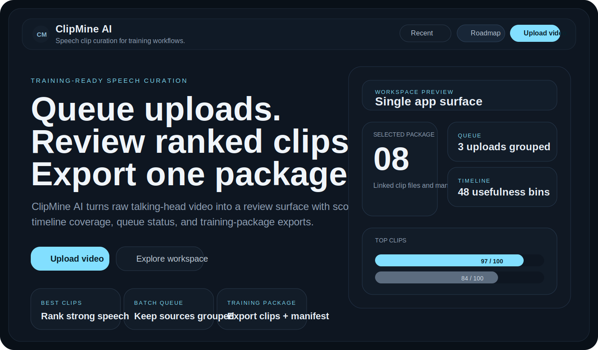
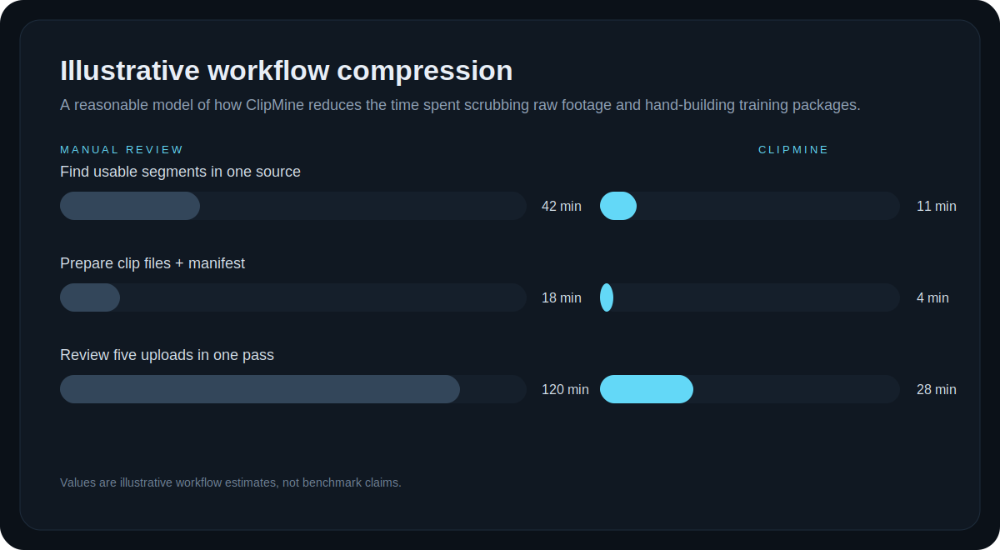
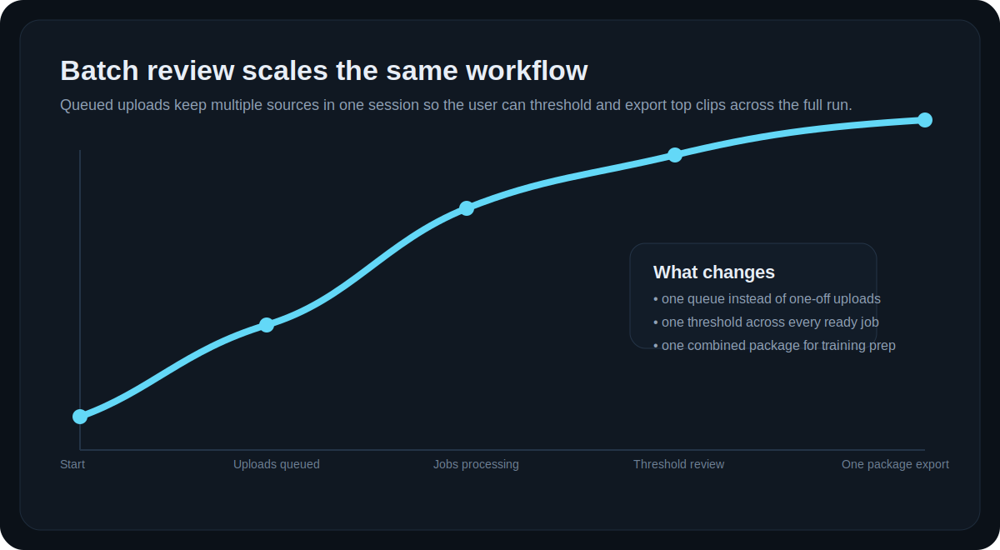
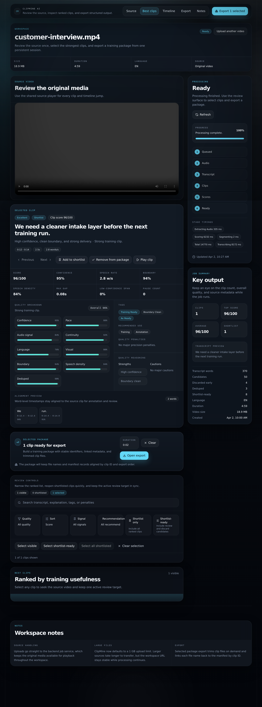
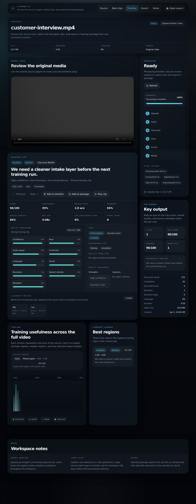
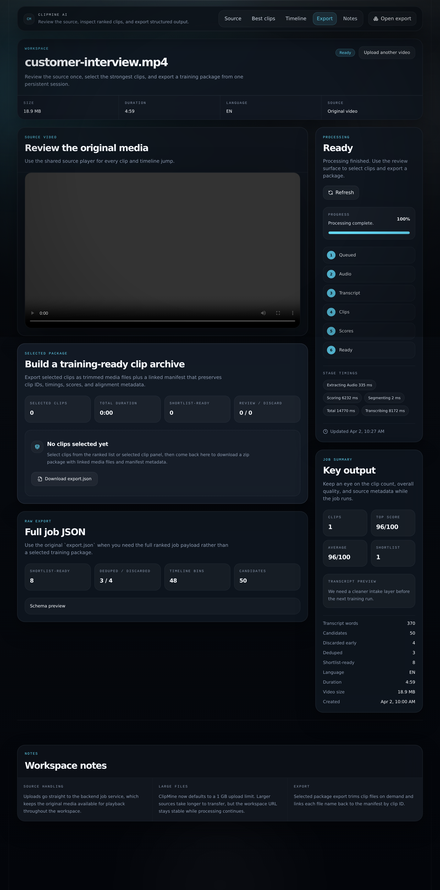
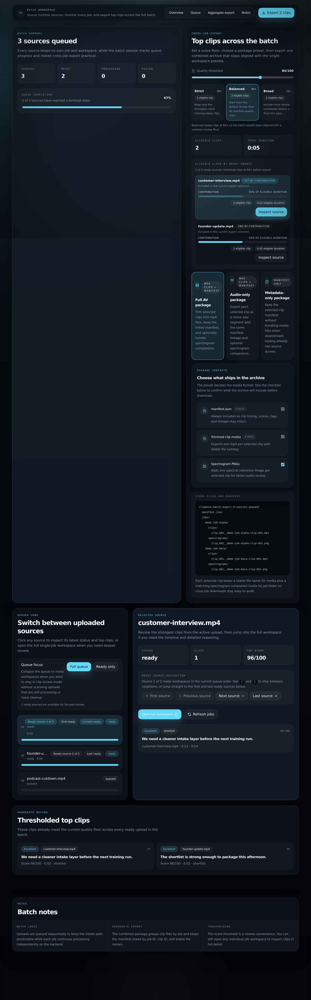
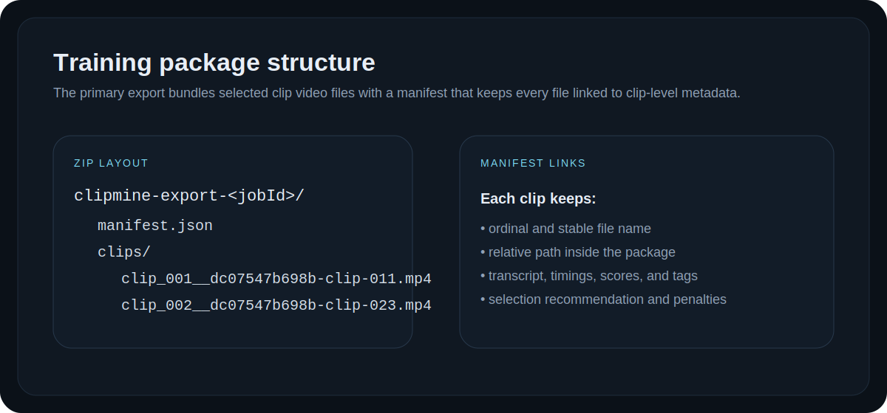

# ClipMine AI

> Production-ready speech clip curation for dataset builders. Review ranked clips against the original source, then export linked media, spectrograms, and manifest metadata in one handoff.

ClipMine AI turns raw talking-head footage into cleaner training inputs. Upload one source or a full batch, let the backend extract and score candidate speech windows, then review the output through ranked clips, timeline coverage, and export flows designed for annotation and model-training preparation.



## Release status

This repository is prepared as a production-grade release handoff for the shipped application surface.

- The single-job workspace, batch workspace, package export flow, and README visuals were refreshed together for this release.
- Local verification passed with `npm run test:web`, `npm run test:api`, `npm run build:web`, `npm run test:e2e`, and `npm run generate:readme-assets`.
- Remaining live-environment checks are explicitly tracked in [PLAN.md](PLAN.md) instead of being hidden or implied.

## Production release checklist

[PLAN.md](PLAN.md) is the release checklist for this repo. It tracks the shipped surface area, automated coverage, remaining live-environment validation, and any explicit release deferrals.

## Why this is useful

Most teams do not need “more transcript.” They need fewer, cleaner clips that are already organized enough to use. ClipMine AI focuses on:

- reducing manual scrub time across long talking-head footage
- prioritizing stronger training signals instead of dumping every segment
- preserving explainable scoring and quality reasoning
- packaging clips and metadata in a structure that is ready for annotation or model-training prep

<p align="center">
  
  
</p>

Values in the graphs are illustrative workflow models, not benchmark claims. The goal is to show the kind of work ClipMine compresses: review, selection, and packaging.

## Product tour

The app now supports both single-source review and batch intake.

| Review workspace | Timeline view |
| --- | --- |
|  |  |

| Export workspace | Batch queue |
| --- | --- |
|  |  |

## Production release scope

### Intake and processing

- upload `.mp4` and `.mov` sources
- support large uploads up to `1 GB` by default
- keep direct uploads for local development
- support multipart object-storage upload mode for production
- resume multipart uploads after a browser refresh or restart
- queue multiple uploads into one batch session
- keep every upload tied to its own persistent review workspace

### Clip intelligence

- extract mono `16 kHz` audio with bundled ffmpeg
- transcribe with `faster-whisper`
- segment short speech clips with filler trimming and boundary checks
- score clips using confidence, pace, signal quality, continuity, and precision-oriented penalties
- dedupe overlapping near-duplicates
- label clips as `shortlist`, `review`, or `discard`
- attach multimodal features, candidate metrics, quality breakdown, penalties, tags, and reasoning

### Review workflow

- ranked clip list with filters and sort controls
- selected clip inspector with detailed signals
- full-video usefulness timeline
- shortlist state per job
- side-by-side comparison for two shortlisted clips
- separate batch-selection state for export
- per-job retry inside the batch workspace
- saved finished-batch shortcuts that can reopen ready review or be dismissed
- live queue guidance with per-source ETA hints
- recent jobs and recent batch sessions stored locally in the browser

### Export workflow

- `export.json` for the full machine-readable job payload
- selected clip package export as a zip archive
- full AV, audio-only, training-dataset, and metadata-only package presets
- package-contents checklist in the export surface before download
- spectrogram PNG companions for full AV and audio-only packages
- stable naming like `clip_001__<clipId>.mp4`
- linked `manifest.json` that maps every exported clip file back to clip metadata
- `metadata.jsonl` training-dataset export with sequential filenames for ML ingestion
- cross-job batch export above a user-defined quality threshold
- batch export warning summaries when one selected source is skipped

## Training package structure

The primary export is no longer just a schema preview. It is a package builder designed for real downstream use, with a checklist that shows exactly which assets leave the workspace.



Single-job package layout:

```text
clipmine-export-<jobId>/
  manifest.json
  clips/
    clip_001__<clipId>.mp4
    clip_002__<clipId>.mp4
  spectrograms/
    clip_001__<clipId>.png
    clip_002__<clipId>.png
```

Batch package layout:

```text
clipmine-batch-export-<label>/
  manifest.json
  jobs/
    <jobId>/clips/clip_001__<clipId>.mp4
    <jobId>/clips/clip_002__<clipId>.mp4
    <jobId>/spectrograms/clip_001__<clipId>.png
    <jobId>/spectrograms/clip_002__<clipId>.png
```

Training dataset layout:

```text
clipmine-export-<jobId>-dataset/
  metadata.jsonl
  video/
    clip_000001.mp4
    clip_000002.mp4
```

## Project goals

- shorten the path from raw footage to usable speech data
- help users review stronger clips first
- keep scoring and selection transparent instead of opaque
- make export structure practical for annotation and training workflows
- support both one-off uploads and higher-throughput batch review

## Local release validation

Use [PLAN.md](PLAN.md) for the final release checklist, especially the live backend, large-file, and object-storage validation steps that still require a real deployment target.

## Architecture

- `desktop`: Electron wrapper that launches the existing FastAPI backend and Next.js frontend without changing their app-layer architecture
- `apps/web`: Next.js 16 App Router frontend with Tailwind, SWR, Framer Motion, and local workspace persistence
- `backend`: FastAPI processing API with disk-backed jobs and optional S3-compatible source storage
- `backend/src/clipmine_api/transcription.py`: `faster-whisper` transcription
- `backend/src/clipmine_api/segmentation.py`: transcript-to-candidate clip generation
- `backend/src/clipmine_api/scoring.py`: transparent training-usefulness scoring
- `backend/src/clipmine_api/precision.py`: precision pass, penalties, and dedupe logic
- `backend/src/clipmine_api/package_export.py`: selected clip package and batch package export

The frontend talks directly to the backend for upload initialization, polling, playback, and export. Local development stays simple with direct uploads. Production can switch to multipart uploads backed by object storage without changing the review workflow.

## Why these metrics

ClipMine does not use the metrics because they are fashionable. It uses them because each one answers a specific curation question:

- `confidence`: a clip with weak ASR confidence is harder to trust as training supervision
- `speech_rate`: clips that are too slow or too rushed are usually harder to label and less stable for downstream use
- `energy` and `acoustic_signal`: low-signal or noisy clips often look acceptable in text while still being poor audio examples
- `silence_ratio` and `continuity`: pause-heavy segments waste review time and usually produce weaker training slices
- `boundary_cleanliness`: clips that start or end mid-thought create ambiguous supervision and messy exports
- `speech_density`: denser clips usually carry more useful speech content per second
- `linguistic_clarity`: filler-heavy or muddled text reduces how cleanly a clip can be reused
- `visual_readiness`: for audiovisual use, the face needs to be visible and reasonably active; weak visual support should lower confidence without automatically discarding a strong audio clip
- `dedupe_confidence`: near-duplicate clips crowd the shortlist without adding new supervision value
- `selection_recommendation` and `quality_penalties`: the numeric score alone is not enough; users need a machine-readable recommendation plus reasons they can audit

That combination is meant to balance two things:

- practical review speed for humans
- clip quality signals that map to real downstream training or annotation work

## README visuals stay current

GitHub README pages cannot embed live iframe renders reliably, so this repo uses generated screenshots instead.

- `.github/workflows/readme-assets.yml` rebuilds the web app on pushes to `main`
- `scripts/generate-readme-assets.mjs` captures product screenshots and rewrites visual assets
- updated files are committed back into `docs/readme`
- that workflow may create a follow-up commit on `main`, so pull again before the next publish if UI or README assets changed

That keeps the README visuals aligned to the current UI in a GitHub-compatible way. The repo includes seeded screenshots for convenience, and the GitHub Action remains the reliable refresh path for keeping those assets current on `main`.

## Maintainer publishing note

Use the workspace-local repository normally:

```bash
git pull --ff-only origin main
git add <files>
git commit -m "..."
git push origin main
```

Pushes to `main` can trigger a follow-up `docs/readme` asset refresh commit. After that workflow lands, pull `main` again before stacking the next change.

## Repository layout

```text
.
├── desktop
├── apps/web
├── backend
├── docs/readme
├── scripts
├── .github/workflows
├── AGENT.md
├── DEPLOYMENT.md
├── SUBMISSION.md
└── render.yaml
```

## Local setup

### 1. Configure environment

Copy `.env.example` to `.env` at the repo root and adjust values if needed.

Important defaults:

- `NEXT_PUBLIC_MAX_UPLOAD_MB=1024`
- `NEXT_PUBLIC_UPLOAD_MODE=direct`
- `MAX_UPLOAD_MB=1024`
- `BACKEND_CORS_ORIGINS=http://localhost:3000,http://127.0.0.1:3000`
- `LOG_LEVEL=DEBUG`

### 2. Install frontend dependencies

```bash
npm_config_cache=/tmp/clipmine-npm-cache npm install
```

### 3. Install backend dependencies

```bash
cd backend
python3 -m venv .venv
source .venv/bin/activate
pip install -e ".[dev]"
cd ..
```

### 4. Run the desktop app

Single-command desktop launcher:

```bash
npm run start:desktop
```

This starts the FastAPI backend in the background, starts or reuses the Next.js frontend, waits for both services to become ready, and opens the app inside an Electron window. Closing the desktop app shuts down any backend or frontend processes that Electron started.

### 5. Build a launcher-ready desktop bundle

Platform-local desktop packaging:

```bash
npm run dist:desktop
```

On macOS this produces a launcher-ready `.app` and `.dmg` in `dist/desktop`. On Windows it produces an NSIS installer with Start Menu and desktop shortcut support. The desktop bundle packages the Next.js standalone frontend plus the local `backend/.venv`, so create the backend virtualenv before building.

### 6. Run the browser version if needed

Single-command local launcher:

```bash
npm run start:app
```

This starts the FastAPI backend and Next.js frontend together, waits for both to be ready, and opens the app in your browser automatically.

If you need to debug each service separately:

```bash
npm run dev:web
npm run dev:api
```

Open [http://localhost:3000](http://localhost:3000).

## Root commands

```bash
npm run start:desktop
npm run build:desktop
npm run dist:desktop
npm run start:app
npm run dev:web
npm run build:web
npm run start:web
npm run lint:web
npm run test:web
npm run benchmark:uploads -- --direct-base-url http://127.0.0.1:8000 --multipart-base-url https://your-multipart-backend.example.com
npm run generate:readme-assets
npm run dev:api
npm run test:api
npm run test:e2e
```

## How to use the app

1. Open the landing page.
2. Upload one `.mp4` or `.mov`, or select multiple files to start a queue.
3. Wait for the backend to move through extraction, transcription, segmentation, and scoring.
4. Open an individual job workspace to review ranked clips and timeline coverage.
5. Pin or batch-select the clips you want to keep.
6. Download either:
   - `selected package` for clip files plus manifest
   - `export.json` for the full job payload
   - `combined batch package` for top clips across ready jobs above a chosen threshold

## Verification

Web:

```bash
npm run lint:web
npm run test:web
npm run build:web
```

Backend:

```bash
npm run test:api
```

Browser smoke:

```bash
npm run test:e2e
```

Verbose backend logging is enabled by default for local debugging through `LOG_LEVEL=DEBUG`.
